# LiteLLM Infrastructure Architecture

This document provides a comprehensive overview of the LiteLLM infrastructure architecture, including AWS resources, multi-container deployment, and repository integration patterns.

## 🏗️ System Architecture Overview

## 🐳 Multi-Container Architecture

## 🔄 Repository Integration Flow

```mermaid
sequenceDiagram
    participant Dev as 👨‍💻 Developer
    participant AppRepo as 📦 litellm-app
    participant ECR as 🏪 AWS ECR
    participant InfraRepo as 🏗️ litellm-infra
    participant ECS as ☁️ AWS ECS

    Dev->>AppRepo: 1. Push code changes
    AppRepo->>AppRepo: 2. Build container with guardrails
    AppRepo->>ECR: 3. Push tagged image
    AppRepo->>InfraRepo: 4. Repository dispatch event
    
    Note over InfraRepo: Receives image URI + commit SHA
    
    InfraRepo->>InfraRepo: 5. Update task definition
    InfraRepo->>ECS: 6. Deploy new container
    ECS->>ECR: 7. Pull new image
    ECS->>ECS: 8. Start multi-container task
    
    Note over ECS: Ollama pulls model<br/>LiteLLM starts with new config
    
    ECS-->>Dev: 9. Deployment ready
```

## 🌐 Network Architecture

```mermaid
graph TB
    subgraph "VPC: 10.0.0.0/16"
        subgraph "Public Subnets"
            subgraph "AZ-1a: 10.0.1.0/24"
                ALB1[ALB Instance]
                NAT1[NAT Gateway]
            end
            subgraph "AZ-1b: 10.0.2.0/24"
                ALB2[ALB Instance]
            end
        end

        subgraph "Private Subnets"
            subgraph "AZ-1a: 10.0.10.0/24"
                ECS1[ECS Task<br/>LiteLLM + Ollama]
            end
            subgraph "AZ-1b: 10.0.20.0/24"
                ECS2[ECS Task<br/>LiteLLM + Ollama]
            end
        end

        subgraph "Database Subnets"
            subgraph "AZ-1a: 10.0.100.0/24"
                RDS1[RDS Primary]
            end
            subgraph "AZ-1b: 10.0.200.0/24"
                RDS2[RDS Standby]
            end
        end

        IGW[Internet Gateway]
    end

    Internet[🌐 Internet] --> IGW
    IGW --> ALB1
    IGW --> ALB2
    ALB1 --> ECS1
    ALB2 --> ECS2
    ECS1 --> NAT1
    ECS2 --> NAT1
    NAT1 --> IGW
    ECS1 <--> RDS1
    ECS2 <--> RDS1

    classDef public fill:#e3f2fd
    classDef private fill:#f3e5f5
    classDef database fill:#fff3e0
    
    class ALB1,ALB2,NAT1,IGW public
    class ECS1,ECS2 private
    class RDS1,RDS2 database
```

## 🔐 Security Architecture

## 🚀 CI/CD Pipeline Architecture

```mermaid
graph TB
    subgraph "Development Workflow"
        Dev[👨‍💻 Developer]
        
        subgraph "litellm-app Repository"
            AppCode[Application Code<br/>Guardrails + Config]
            Dockerfile[Dockerfile<br/>Multi-stage Build]
            AppCI[GitHub Actions<br/>Build & Push]
        end
        
        subgraph "litellm-infra Repository"
            TerraformCode[Terraform Modules<br/>Infrastructure as Code]
            InfraCI[GitHub Actions<br/>Deploy & Destroy]
            Environments[Environment Configs<br/>dev, staging, prod]
        end
    end

    subgraph "AWS Infrastructure"
        ECR[AWS ECR<br/>Container Registry]
        ECS[AWS ECS<br/>Multi-Container Tasks]
        
        subgraph "Terraform State"
            S3[S3 Bucket<br/>State Storage]
            DynamoDB[DynamoDB<br/>State Locking]
        end
    end

    Dev -->|1. Code Changes| AppCode
    AppCode --> Dockerfile
    Dockerfile --> AppCI
    AppCI -->|2. Build & Push| ECR
    AppCI -->|3. Repository Dispatch| InfraCI
    
    Dev -->|4. Infrastructure Changes| TerraformCode
    TerraformCode --> InfraCI
    InfraCI <-->|5. State Management| S3
    InfraCI <-->|6. Locking| DynamoDB
    InfraCI -->|7. Deploy| ECS
    ECS <-->|8. Pull Images| ECR

    classDef repo fill:#e3f2fd
    classDef aws fill:#fff3e0
    classDef dev fill:#f3e5f5
    
    class AppCode,Dockerfile,AppCI,TerraformCode,InfraCI,Environments repo
    class ECR,ECS,S3,DynamoDB aws
    class Dev dev
```

## 🔑 Secret Management Flow

## 🤖 Model Routing Architecture

```mermaid
graph TB
    subgraph "Client Request"
        Client[📱 Client Application]
        Request[HTTP Request<br/>model gpt-4o-mini]
    end

    subgraph "LiteLLM Proxy Layer"
        ALB[🔀 Application Load Balancer]
        Auth[🔐 Authentication<br/>Master Key Validation]
        
        subgraph "PII Guardrails"
            PreCall[🛡️ Pre-Call Guardrail<br/>Scan Input for PII]
            PostCall[🛡️ Post-Call Guardrail<br/>Scan Output for PII]
        end
        
        Router[🎯 Model Router<br/>Route to Provider]
    end

    subgraph "Model Providers"
        subgraph "Local Models"
            Ollama[🤖 Ollama Server<br/>localhost:11434]
            LocalModel[🧠 llama3.2-3b<br/>~2GB Model]
        end
        
        subgraph "Cloud Models"
            OpenAI[☁️ OpenAI API<br/>gpt-4o-mini]
            Anthropic[☁️ Anthropic API<br/>claude-3-5-sonnet]
            Azure[☁️ Azure OpenAI<br/>gpt-4o]
        end
    end

    subgraph "Data Layer"
        RDS[(🗄️ PostgreSQL<br/>User Data, Logs, Analytics)]
    end

    Client --> Request
    Request --> ALB
    ALB --> Auth
    Auth --> PreCall
    PreCall --> Router
    
    Router -->|Local Request| Ollama
    Router -->|Cloud Request| OpenAI
    Router -->|Cloud Request| Anthropic
    Router -->|Cloud Request| Azure
    
    Ollama --> LocalModel
    
    OpenAI --> PostCall
    Anthropic --> PostCall
    Azure --> PostCall
    Ollama --> PostCall
    
    PostCall --> Client
    Router --> RDS

    classDef client fill:#e3f2fd
    classDef proxy fill:#fff3e0
    classDef local fill:#e8f5e8
    classDef cloud fill:#f3e5f5
    classDef data fill:#fce4ec
    
    class Client,Request client
    class ALB,Auth,PreCall,PostCall,Router proxy
    class Ollama,LocalModel local
    class OpenAI,Anthropic,Azure cloud
    class RDS data
```

## 🔄 Deployment Flow Architecture

## 🛡️ PII Guardrail Architecture

```mermaid
graph TB
    subgraph "PII Detection Pipeline"
        Input[📥 User Input<br/>Chat Message]
        
        subgraph "Pre-Call Guardrails"
            RegexPre[🔍 Regex Detection<br/>Email, SSN, Phone, Credit Card]
            PresidioPre[🧠 Presidio ML Detection<br/>50+ Entity Types]
            PreDecision{🚫 Block Request?}
        end
        
        subgraph "Model Processing"
            ModelCall[🤖 Model Inference<br/>Local or Cloud]
            ModelResponse[📤 Model Response]
        end
        
        subgraph "Post-Call Guardrails"
            RegexPost[🔍 Regex Detection<br/>Output Scanning]
            PresidioPost[🧠 Presidio ML Detection<br/>Response Analysis]
            PostDecision{🚫 Block Response?}
        end
        
        Output[📤 Final Response<br/>PII-Free Content]
        Blocked[🚫 Blocked Response<br/>PII Detected]
    end

    Input --> RegexPre
    Input --> PresidioPre
    RegexPre --> PreDecision
    PresidioPre --> PreDecision
    
    PreDecision -->|✅ Safe| ModelCall
    PreDecision -->|❌ PII Found| Blocked
    
    ModelCall --> ModelResponse
    ModelResponse --> RegexPost
    ModelResponse --> PresidioPost
    RegexPost --> PostDecision
    PresidioPost --> PostDecision
    
    PostDecision -->|✅ Safe| Output
    PostDecision -->|❌ PII Found| Blocked

    classDef input fill:#e3f2fd
    classDef guard fill:#fff3e0
    classDef model fill:#e8f5e8
    classDef decision fill:#ffebee
    classDef output fill:#f3e5f5
    
    class Input input
    class RegexPre,PresidioPre,RegexPost,PresidioPost guard
    class ModelCall,ModelResponse model
    class PreDecision,PostDecision decision
    class Output,Blocked output
```

## 📊 Resource Allocation Architecture

## 🔄 Container Lifecycle Management

## 🌍 Multi-Environment Architecture

## 🔍 Request Flow Architecture

```mermaid
sequenceDiagram
    participant Client as 📱 Client
    participant ALB as 🔀 ALB
    participant LiteLLM as 📦 LiteLLM
    participant Guardrails as 🛡️ Guardrails
    participant Ollama as 🤖 Ollama
    participant OpenAI as ☁️ OpenAI
    participant RDS as 🗄️ Database

    Client->>ALB: POST /v1/chat/completions
    ALB->>LiteLLM: Route request
    LiteLLM->>LiteLLM: Validate API key
    LiteLLM->>Guardrails: Pre-call PII scan
    
    alt PII Detected
        Guardrails-->>Client: 400 Bad Request (PII blocked)
    else Safe Input
        Guardrails->>LiteLLM: Input approved
        
        alt Local Model Request
            LiteLLM->>Ollama: Forward to localhost:11434
            Ollama->>Ollama: llama3.2-3b inference
            Ollama-->>LiteLLM: Model response
        else Cloud Model Request
            LiteLLM->>OpenAI: Forward with API key
            OpenAI-->>LiteLLM: Model response
        end
        
        LiteLLM->>Guardrails: Post-call PII scan
        
        alt Response PII Detected
            Guardrails-->>Client: 400 Bad Request (PII blocked)
        else Safe Response
            Guardrails->>LiteLLM: Response approved
            LiteLLM->>RDS: Log request/response
            LiteLLM-->>Client: Final response
        end
    end
```

## 🏷️ Image Tagging Strategy

## 🔧 Infrastructure Components

### **AWS Resources Created:**

| Component | Resource Type | Purpose | Configuration |
|-----------|---------------|---------|---------------|
| **VPC** | aws_vpc | Network isolation | 10.0.0.0/16 CIDR |
| **Subnets** | aws_subnet | Network segmentation | Public, Private, Database |
| **Internet Gateway** | aws_internet_gateway | Internet access | Single per VPC |
| **NAT Gateway** | aws_nat_gateway | Outbound internet for private subnets | Single for cost optimization |
| **Application Load Balancer** | aws_lb | Traffic distribution | Internet-facing |
| **Target Group** | aws_lb_target_group | Health checks and routing | Port 4000 |
| **ECS Cluster** | aws_ecs_cluster | Container orchestration | Fargate with Container Insights |
| **ECS Service** | aws_ecs_service | Service management | Multi-container task definition |
| **ECS Task Definition** | aws_ecs_task_definition | Container specifications | LiteLLM + Ollama containers |
| **RDS Instance** | aws_db_instance | Database | PostgreSQL 15.8, db.t3.micro |
| **Security Groups** | aws_security_group | Network access control | ALB, ECS, RDS, VPC endpoints |
| **IAM Roles** | aws_iam_role | Service permissions | Task role, Execution role |
| **SSM Parameters** | aws_ssm_parameter | Secret storage | Master key, API keys, DB URL |
| **CloudWatch Log Groups** | aws_cloudwatch_log_group | Centralized logging | Separate streams per container |

### **Resource Dependencies:**

## 🔄 Container Communication Patterns

## 📈 Scaling Architecture

## 🎯 Architecture Design Principles

### **Separation of Concerns:**
- **Infrastructure** (litellm-infra): AWS resources, networking, security
- **Application** (litellm-app): Business logic, models, guardrails

### **Security by Design:**
- **Network isolation**: Private subnets, security groups
- **Secret management**: Auto-generated, encrypted storage
- **Access control**: IP restrictions, authentication required
- **Container security**: Non-root execution, health checks

### **Scalability:**
- **Horizontal scaling**: Auto-scaling ECS tasks
- **Vertical scaling**: Configurable CPU/memory allocation
- **Multi-AZ deployment**: High availability across zones
- **Load balancing**: Traffic distribution across healthy targets

### **Observability:**
- **Centralized logging**: CloudWatch Logs with separate streams
- **Health monitoring**: Container and application health checks
- **Metrics**: ECS, ALB, and RDS performance metrics
- **Traceability**: Request logging and audit trails

### **Cost Optimization:**
- **Right-sizing**: Environment-specific resource allocation
- **Single NAT Gateway**: Cost optimization for development
- **Spot instances**: Optional for non-critical workloads
- **Automated cleanup**: Destroy workflows for temporary environments

---

**This architecture provides a production-ready, secure, and scalable foundation for LiteLLM deployment with local AI model serving capabilities and comprehensive PII protection.**
